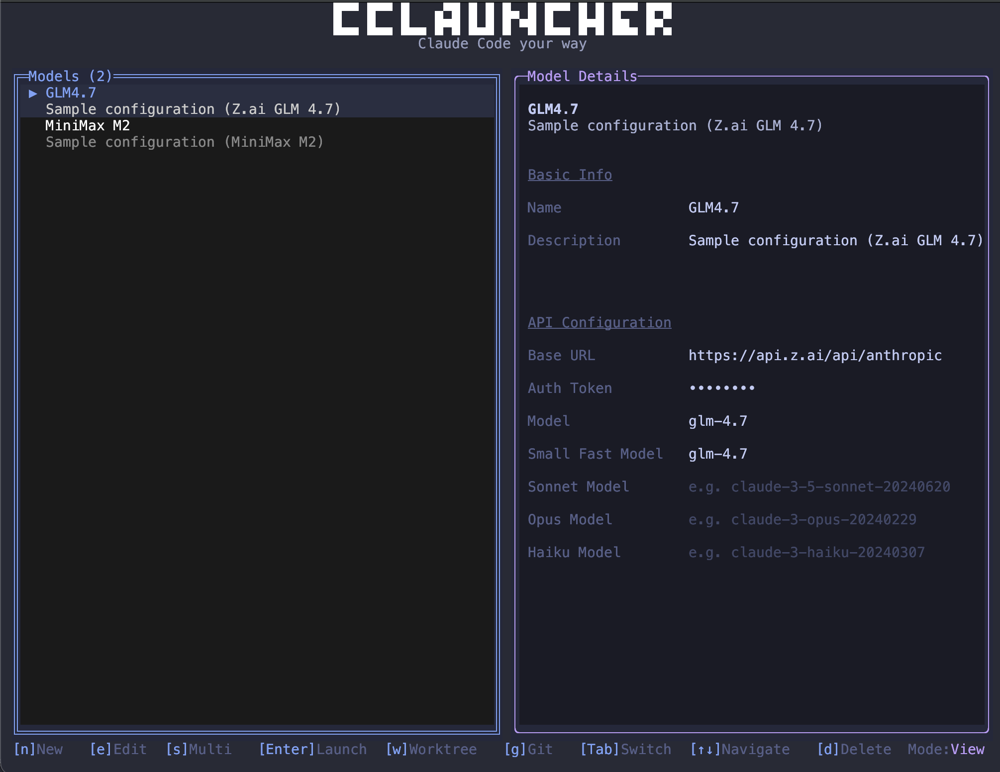
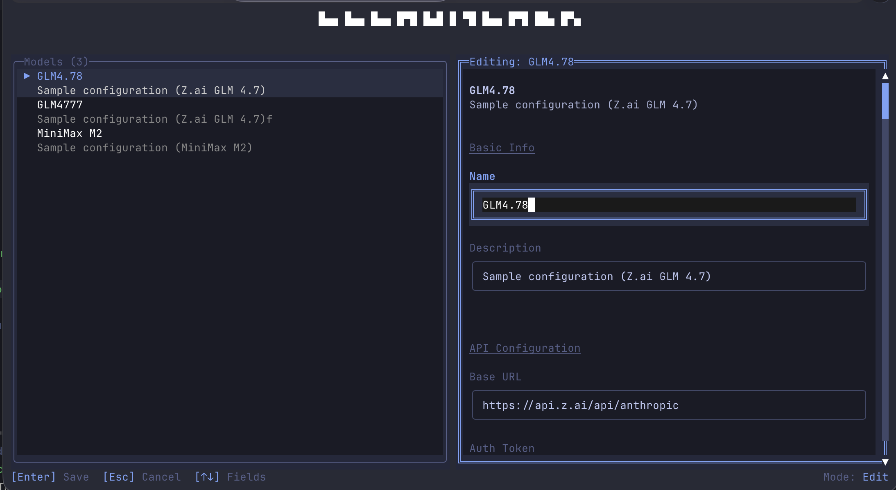
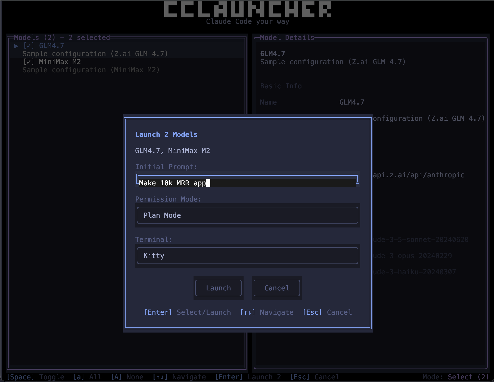
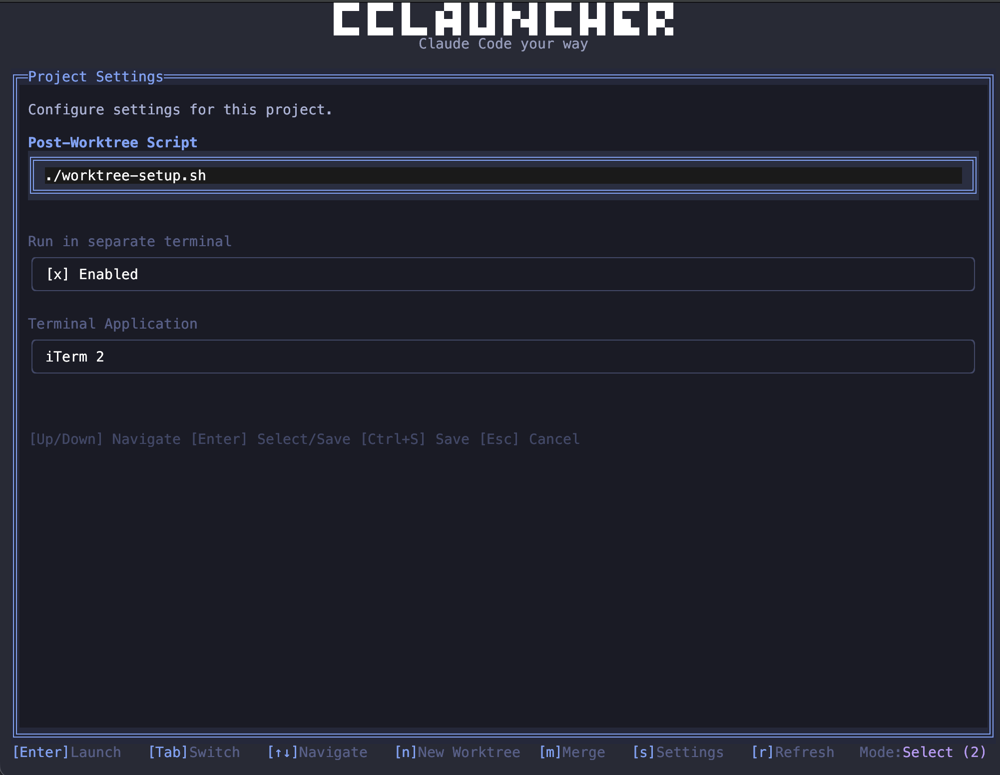

# CCLauncher

Launch Claude Code instances with the right model, endpoint, worktree, and auth without ever editing configs. CCLauncher is a keyboard-first TUI + CLI that injects the correct `ANTHROPIC_*` environment variables for each session so you can switch providers and models in seconds.

I built this to solve my own workflow pain: bouncing between providers when I hit anthropic usage limits, keeping mutliple copies of settings.json, launching and managing multiple Claude Code sessions in worktrees etc. It ended up being useful enough that I use it daily, and I hope it can help your workflow too.



## Why it exists

- **Switching Claude Code configs is friction**: CCLauncher makes it a single keystroke.
- **Parallel Claude Code sessions are messy**: multi-launch and worktrees keep them clean.
- **Projects need setup steps**: optionally run a script every time a worktree is created.

## Feature tour (with screenshots)

### 1) Model management that feels instant

Create, edit, reorder, and launch model profiles without leaving the TUI or modifying your `.claude/settings.json` every time you want to use claude code with a different provider. Each profile defines an endpoint, auth token, and model IDs so you can jump between Anthropic compatible providers and self-hosted gateways.

How to use it:
- Press `n` to create a model.
- Press `e` to edit the selected model.
- Press `m` to reorder models.
- Press `Enter` to launch Claude Code with the selected profile.



### 2) Git worktrees 

Want to spin up claude code to work on a specific task without interfering with your main workspace? Toggle worktree mode to spin up a detached worktree per launch. Perfect for parallel tasks and disposable experiments.

How to use it:
- Press `w` to toggle worktree mode (only in git repos).
- Press `Enter` to launch in a fresh worktree.


### 3) Multi-launch for parallel intelligence

Launch multiple Claude Code instances at once with a shared prompt and permission mode. Compare model behavior side-by-side or fan out tasks across providers.

How to use it:
- Press `s` to enter multi-select.
- Use `Space` to select 2-5 models.
- Press `Enter` and set the prompt and permission mode.



### 4) Per-project automation

Configure a per-repo script (install deps, run migrations, etc.) that runs automatically after worktree creation. You can also run it in an external terminal if you prefer.

How to use it:
- Run `cclauncher --project-config --set-script ./setup.sh`
- Optional: `cclauncher --project-config --spawn-in-terminal true --terminal-app Warp`



## Quick start

### Prereqs

- **Bun** installed and on your `PATH` (`bun --version`)
- **Claude Code** installed (`claude --version`)

Install Claude Code if needed:

```bash
npm install -g @anthropic-ai/claude-code
```

### Install CCLauncher

```bash
npm install -g claude-model-launcher
```

### Run

```bash
cclauncher
```

On first run, CCLauncher creates your model store at `~/.claude-model-launcher/models.json` with a couple starter configs you can edit or delete.

## Install (other)

### Homebrew (macOS)

```bash
brew tap Connorbelez/tap
brew install claude-model-launcher
```

## Usage guide

### TUI basics

Inside the TUI you can:
- **Create models** (`n`)
- **Edit models** (`e`)
- **Reorder models** (`m`)
- **Multi-select + launch** (`s`, then `Space` to toggle, `Enter` to launch)
- **Toggle worktree mode** (`w`, only in git repos)

### CLI shortcuts

- **List models**:

```bash
cclauncher --list
```

- **Launch a model**:

```bash
cclauncher --model mymodel
```

- **Add a model (scriptable)**:

```bash
cclauncher --add --name mymodel \
  --endpoint https://api.anthropic.com \
  --token env:ANTHROPIC_API_KEY \
  --model-id claude-opus-4-5-20251101
```

- **Multi-launch (CLI)**:

```bash
cclauncher --multi minimax openrouter \
  --prompt "Compare answers" \
  --permission-mode plan
```

### CLI reference (full)

#### Usage

```bash
cclauncher [OPTIONS] [COMMAND]
```

#### Commands and modes

- **(no command)**: launch the TUI for interactive model selection
- **`--model <name>`**: launch Claude Code with a named model
- **`--multi <models...>`**: launch multiple models in parallel (separate terminals)
- **`--list`**: list all configured models
- **`--add`**: add a new model (use with `--name`, `--endpoint`, etc.)
- **`--worktree`, `-w`**: create a new worktree and launch Claude Code in it
- **`--worktree-list`**: list all active worktrees
- **`--project-config`**: manage per-project settings
- **`--run-script`**: run the configured setup script in the current directory
- **`--help`**: show help
- **`--version`**: show version
- **Positional model name**: `cclauncher mymodel` is equivalent to `--model mymodel`

#### Options for `--add`

- **`--name <name>`**: model name (required)
- **`--endpoint <url>`**: API endpoint URL
- **`--token <token>`**: auth token (`env:VAR_NAME` supported)
- **`--model-id <id>`**: model identifier (e.g., `claude-opus-4-5-20251101`)
- **`--fast-model <id>`**: fast model identifier
- **`--description <text>`**: model description

#### Options for `--project-config`

- **`--show`**: display the current project config
- **`--set-script <path>`**: set the post-worktree setup script
- **`--spawn-in-terminal <value>`**: run setup script in a separate terminal  
  Accepted values: `true/false/1/0/yes/no/on/off`
- **`--terminal-app <path|name>`**: terminal app to use for the setup script

#### Options for `--multi`

- **`--prompt <text>`**: shared prompt for all instances
- **`--permission-mode <mode>`**: `default|plan|acceptEdits|autoAccept`

#### Examples

```bash
cclauncher
cclauncher minimax
cclauncher --model minimax
cclauncher --list
cclauncher --add --name mymodel \
  --endpoint https://api.example.com \
  --token env:MY_API_TOKEN \
  --model-id claude-opus-4-5-20251101
cclauncher --multi minimax openrouter \
  --prompt "Compare answers" \
  --permission-mode plan
cclauncher --worktree
cclauncher --worktree-list
cclauncher --project-config --show
cclauncher --project-config --set-script ./scripts/setup.sh
cclauncher --project-config --spawn-in-terminal true --terminal-app Warp
cclauncher --run-script
```

### Keyboard shortcuts (cheat sheet)

The status bar in-app is the source of truth, but the common defaults are:

- **View mode**: `n` new, `e` edit, `s` multi-select, `Enter` launch, `d` delete, `Tab` switch panels, `↑↓` navigate
- **Multi-select**: `Space` toggle, `a` select all, `A` clear, `Enter` launch, `Esc` cancel
- **Worktrees panel**: `Enter` launch in selected worktree, `n` new worktree, `m` merge, `s` settings, `r` refresh, `g` back

## Configuration reference

### Where data is stored

- **Models**: `~/.claude-model-launcher/models.json`
- **Per-project settings** (setup script, terminal prefs): `~/.claude-model-launcher/projects.json`

### Token handling (`env:`)

Any field can use `env:NAME` to resolve from your environment at launch time:

- **Example**: `ANTHROPIC_AUTH_TOKEN: "env:ANTHROPIC_API_KEY"`

### Model JSON shape (example)

```json
{
  "example": {
    "name": "example",
    "description": "Example configuration",
    "order": 1,
    "value": {
      "ANTHROPIC_BASE_URL": "https://api.anthropic.com",
      "ANTHROPIC_AUTH_TOKEN": "env:ANTHROPIC_API_KEY",
      "ANTHROPIC_MODEL": "claude-sonnet-4-20250514",
      "ANTHROPIC_SMALL_FAST_MODEL": "claude-haiku-3-5-20241022",
      "ANTHROPIC_DEFAULT_SONNET_MODEL": "",
      "ANTHROPIC_DEFAULT_OPUS_MODEL": "",
      "ANTHROPIC_DEFAULT_HAIKU_MODEL": "",
      "API_TIMEOUT_MS": 600000,
      "DISABLE_NONESSENTIAL_TRAFFIC": true
    }
  }
}
```

## Under the hood (how it works)

### Architecture overview

- **Runtime**: Bun
- **UI**: React + OpenTUI (`@opentui/react`)
- **Validation**: Zod
- **Storage**: JSON files under `~/.claude-model-launcher/`

### Launch flow

1. You select a model (TUI or CLI).
2. CCLauncher loads the model profile from `models.json`.
3. It prepares environment variables (`ANTHROPIC_*`) from the profile.
4. It spawns `claude` with those variables, optionally in a worktree.

### Worktree support

- If you enable worktree mode, CCLauncher creates a detached worktree under `.worktrees/`.
- If a per-project setup script exists, it runs after the worktree is created.
- Each worktree is unique (timestamped) so parallel sessions never collide.

### Multi-launch

- The TUI collects a list of models, a shared prompt, and a permission mode.
- It then launches multiple `claude` processes in parallel, each with its own environment and optional worktree.

## Troubleshooting

- **Claude not found**: install with `npm install -g @anthropic-ai/claude-code` and ensure `claude` is on `PATH`.
- **Worktree commands fail**: worktree features require running inside a git repo.
- **Auth errors**: if you used `env:MY_VAR`, confirm it is set in your shell (`echo $MY_VAR`).

## Contributing

If you like the idea but the UI/UX needs polish, I would love help cleaning up the TUI experience. Contributions that improve layout, clarity, and keyboard flow are especially welcome.

Please open an issue or PR with your ideas, or reach out with feedback.

## Development

```bash
bun install
bun dev
```

## License

Apache-2.0